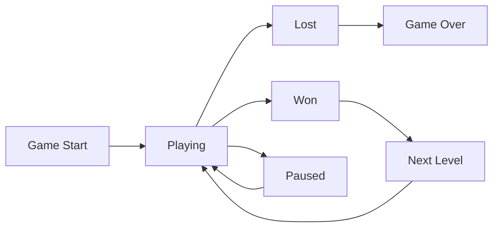

# Platform Game Documentation

## Game Elements

### Static Elements

| Symbol | Description | Behavior |
|--------|-------------|----------|
| `.`    | Empty tile  | Passable space |
| `#`    | Wall        | Blocks movement |
| `@`    | Player spawn| Starting position |
| `○`    | Coin        | Collectible item |
| `+`    | Static lava | Deadly obstacle |

### Dynamic Elements

| Symbol | Description | Movement Pattern |
|--------|-------------|------------------|
| `=`    | Moving lava | Horizontal (←→) |
| `\|`   | Moving lava | Vertical (↑↓) |
| `v`    | Dripping lava| Falls when player below |

## Level Design Guidelines

- Each line break (`\n`) represents a new row
- All rows must have equal width
- Exactly one `@` per level
- All coins must be reachable
- Levels must be enclosed by walls

## Game State Management

### Required State Information
1. **Level Data**
   - Current layout
   - Dimensions
   - Coin positions

2. **Actor States**
   - Player position and velocity
   - Moving hazard positions
   - Animation states

3. **Game Progress**
   - Score
   - Collected coins
   - Current level number
   - Time elapsed

### State Transitions



## Example Levels

### Tutorial Level
```
############
#....○○...#
#@........#
############
```

## State Transitions
1. Game Start → Playing: When level loads
2. Playing → Lost: Player touches hazard
3. Playing → Won: All coins collected
4. Won → Next Level: Load next level
5. Next Level → Playing: Start next level
6. Lost → Game Over: End game session

Lo stato dovra mantenere alcune informazioni
Il livello
L'elenco degli attori
non ricordo ma ce n'è un altro